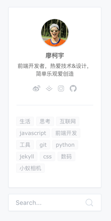
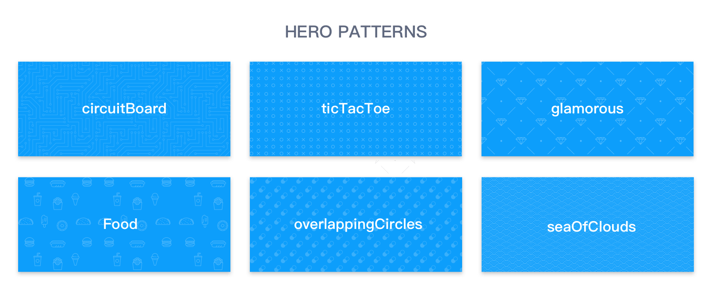

# ghost-theme-H2O

这是jekyll主题H2O的Ghost移植版，[原版项目](https://github.com/kaeyleo/jekyll-theme-H2O)。
ghost compatible H2O theme, fork from [kaeyleo/jekyll-theme-H2O](https://github.com/kaeyleo/jekyll-theme-H2O).

### Usage 快速开始

首先请[安装Ghost](https://ghost.org/developers/)。
[Install Ghost](https://ghost.org/developers/) firstly.

此主题在Ghost 1.14.1环境下开发，不对其早期版本做任何承诺，请尽可能使用最新版。
This theme is developed under Ghost 1.14.1. There is no guarantee for any previous version. Please update to newer version.

此主题运行依赖于*Public API*，请确保在Ghost设置的 Labs - Beta features 启用了Public API。
This theme requires *Public API*. Please make sure to enable it in dashboard Labs - Beta features*

您可以Fork目录至`content/theme`下，或下载zip包在后台上传安装。
You can fork this repository to your `content/theme` directory, or download zip file then upload to the ghost dashboard.

主题安装与配置请查阅[Ghost文档](https://ghost.org/developers/)。
More documents about theme installation plese read [the Ghost Document](https://ghost.org/developers/).

### Document 配置文档

配置文件位于`partials/layouts/config.hbs`。
Configuration file is located in `partials/layouts/config.hbs`.

(如下给出的代码均为默认配置）

#### CN

- 开始
	- [站点信息](#站点信息)
	- [用户配置](#用户配置)
- 组件
	- [侧边栏](#侧边栏)
	- [社交图标与个人简介](#社交图标与个人简介)
	- [标签推荐](#标签推荐)
	- [代码高亮](#代码高亮)
	- [夜间模式](#夜间模式)
- 个性化
	- [主题皮肤](#主题皮肤)
	- [头图底纹](#头图底纹)
- 集成服务
	- [Disqus](#Disqus)
	- [Share.js](#Share.js)
- 高级部分
	- [自定义](#自定义)

#### EN

- Get Started
	- [Site Settings](#站点信息)
	- [User Configuration](#用户配置)
- Components
	- [Sidebar](#侧边栏)
	- [SNS Icons & Personal Information](#社交图标与个人简介)
	- [Tags](#标签推荐)
	- [Syntax Highlight](#代码高亮)
	- [Night Mode](#夜间模式)
- Style
	- [Theme Color](#主题皮肤)
	- [Hero Background Patterns](#头图底纹)
- Plugins
	- [Disqus](#Disqus)
	- [Share.js](#Share.js)
- Advanced
	- [Customization](#自定义)

#### 站点信息

与Jekyll不同，Ghost系统本身就能够支持很多功能，如下列出了只需要在Ghost后台修改便可以生效的功能：

- 站点信息（名称，描述，Icon与Logo）
- 头图（文章头图，标签头图，全站头图）
- 站点导航
- Tag详情页

#### 用户配置

与Jekyll的单用户站点不同，Ghost是多用户系统。Ghost自身便提供了多用户的平台。

不过用户信息并不够丰富，而且在很多地方有用户缺失的现象（比如网站首页）。那么首先我们可以配置在缺失情况下的默认显示用户。

```
default_author_in_ghost=false
```

此选项指定是否指定一个Ghost系统用户作为默认用户。如果为false，则使用配置文件中给出的用户信息作为默认用户

若default_author_in_ghost为true，使用如下配置指定作为默认用户的Ghost用户slug。slug可以从Ghost管理后台的用户管理中找到。

```
default_author_slug="ghost"
```

相反，若default_author_in_ghost为false，则使用如下配置描述默认用户的信息。

头像：

```
default_author_avatar="assets/img/profile.png"
```

用户名:

```
default_author_name=""
```

签名:

```
default_author_bio=""
```

社交网站地址，按需配置，留空不显示:

```
default_author_sns_weibo=""
default_author_sns_zhihu=""
default_author_sns_twitter=""
default_author_sns_instagrame=""
default_author_sns_juejin=""
default_author_sns_github=""
default_author_sns_douban=""
default_author_sns_facebook=""
default_author_sns_dribble=""
default_author_sns_uicn=""
default_author_sns_jianshu=""
default_author_sns_medium=""
default_author_sns_linkedin=""
```

这样就可以配置好我们的默认用户信息了。

当然，对于很多个人站点而言，并没有使用到多用户的功能，那么也可以在上述配置的基础上，一键关闭Ghost用户系统功能，这样所有的页面都会显示为配置好的默认用户了：

```
disable_ghost_author=true
```

#### 侧边栏



侧边栏分为两个部分：【个人简介】和【推荐标签】。当屏幕宽度小于960px时，侧边栏会被隐藏。

#### 社交图标与个人简介

使用阿里的图标管理平台Iconfont整理了一套常用的社交图标用于博客的个人简介上，包括微博、知乎、掘金、简书、Github等十三个网站，并且对鼠标悬停时的样式颜色进行了优化。

可选参数：

社交网站 | 参数
--------|----
微博 | `weibo`
知乎 | `zhihu`
推特 | `twitter`
Instagrame | `instagrame`
掘金 | `juejin`
Github | `github`
豆瓣 | `douban`
Facebook | `facebook`
Dribble | `dribble`
UI中国 | `uicn`
简书 | `jianshu`
Medium | `medium`
领英 | `linkedin`

社交图标与个人简介均使用用户配置的设定。

#### 标签推荐

对侧边栏的标签模块进行相应配置：

```
recommend_tags=true
recommend_condition_size=12

```

Tags配置说明：

 属性 | 参数 | 描述
-----|-----|-------
`recommend_tags ` | `true`, `false` | 是否显示推荐标签
`recommend_condition_size ` | `12` 或其他数字 | 推荐标签个数限制

#### 代码高亮

模板引入了[Prism.js](http://prismjs.com)，一款轻量、可扩展的代码语法高亮库。

很多知名网站如[MDN](https://developer.mozilla.org/)、[css-tricks](https://css-tricks.com/)也在用它，就连 JavaScript 之父 [Brendan Eich](https://brendaneich.com/) 也在个人博客上使用。


遵循 [HTML5](https://www.w3.org/TR/html5/grouping-content.html#the-pre-element) 标准，Prism 使用语义化的 `<pre>` 元素和 `<code>` 元素来标记代码区块：

```
<pre><code class="language-css">p { color: red }</code></pre>
```

在Ghost编辑器中你可以这样写：


	 ```css
		p { color: red }
	 ```

支持语言：

- HTML
- CSS
- Sass
- JavaScript
- CoffeeScript
- Java
- C-like
- Swift
- PHP
- Go
- Python

#### 夜间模式

晚11点至次日凌晨6点自动开启夜间模式。如果不需要，则将配置文件中 `nightMode ` 属性的值改为 `false` 即可。

```
nightMode=true
```

说明 | 参数
----|-----
开启夜间模式 | `true`
关闭夜间模式 | `false`

#### 主题皮肤


支持两种主题颜色蓝色（默认）和粉色

主要效果体现在首页博客封面、顶部导航栏的logo以及鼠标悬停时文字显示的颜色效果。

```
theme_color="default"
```

颜色 | 参数
----|-----
蓝色 | `"default"`
粉色 | `"pink"`

#### 头图底纹



在没有图片的情况下单纯显示颜色会不会太无趣了点？于是想到了加入底纹元素，底纹素材是SVG格式的（保存在css样式里），加载比图片快很多。六种底纹（电路、食物、云海、钻石等等）供你选择，配置如下：

```
postPatterns="circuitBoard"
```

`postPatterns` 属性参数配置：

底纹描述  |  参数
------|------
电路 | `"circuitBoard"`
圆环 | `"overlappingCircles"`
吃货日常：啃打鸡 | `"food"`
土豪必备：钻石| `"glamorous"`
圈圈叉叉 | `"ticTacToe"`
中国风：云海 | `"seaOfClouds"`

#### Disqus

[Disqus](https://disqus.com/)是一个第三方社交评论插件，体验相当不错。

模板默认关闭Disqus评论插件，如需开启请在配置文件中找到Disqus的相关配置，设置 `disqus` 参数为 `true` 打开评论功能，并且设置 `disqus_url`。

```
disqus=false
disqus_url="https://YOUR_DISQUS_DOMAIN.disqus.com/embed.js"
```

#### Share.js

为了让文章更方便地分享，使用了第三方分享插件[Share.js](http://overtrue.me/share.js/)，支持一键分享到微博、QQ空间、QQ好友、微信、腾讯微博、豆瓣、Facebook、Twitter、Linkedin、Google+、点点等社交网站。

```
social_share=true
social_share_items="'wechat','weibo','douban','twitter'"
```

#### 自定义

由于Ghost主题引擎与Jekyll主题引擎并不相同，所以Jekyll版与Ghost版的文件结构不同。

不过主题开发使用的技术栈依然不变：引入jQuery类库、使用Sass代替CSS编写样式，使用Gulp完成Sass的编译、CSS和JavaScript的代码合并压缩等任务。

如果你喜欢折腾，想对模板的代码进行修改，需要使用命令 `npm install` 安装 `package.json` 中的依赖，然后 `gulp` 一下即可开始你的自定义之旅。

在了解H2O主题的目录结构之前，确保你对[Ghost主题目录结构](http://themes.ghost.org/docs/structure)有所了解。

```
├── package.json # 主题注册信息以及管理项目的依赖项
├── gulpfile.js # 自动化任务脚本
├── index.hbs # Ghost主题index入口，流向partials/layouts/entry.hbs
├── post.hbs # Ghost主题post入口，流向partials/layouts/entry.hbs
├── partials # 主题partials目录
│   ├── author.hbs # 用户选择逻辑
│   ├── author_default.hbs # 渲染自定义用户
│   ├── author_ghost.hbs # 渲染ghost用户
│   ├── usercard.hbs # 用户信息卡渲染模板
│   ├── tagcard.hbs # 标签信息卡渲染模板
│   ├── footer.hbs # 页脚
│   ├── head.hbs # html文档的头部内容
│   ├── header.hbs # 顶部菜单栏
│   ├── navigation.hbs # 站点导航组件
│   ├── pagination.hbs # 文章分页器组件
│   └── layouts # 布局模板
│       ├── config.hbs # 用户配置，流向default.hbs
│       ├── default.hbs # 页面基础模板，正文流向route.hbs
│       ├── entry.hbs # 默认配置，流向config.hbs
│       ├── index.hbs # index, home, author, tag类页面基础模板
│       ├── post.hbs # post, page类页面基础模板
│       └── route.hbs # 正文路由，根据渲染参数流向各自页面
├── assets # 静态文件和gulp编译生成的目标文件，如需修改css和js文件请到dev文件夹
│   ├── css # 编译生成样式表
│   ├── fonts # 字体文件
│   ├── icons # 图标文件
│   ├── img # 静态图像
│   └── js # 编译生成的js脚本
├── dev # 开发文件
│   ├── js # 存放脚本源码
│   └── sass # 样式源码
│       ├── app.scss # 整合下面的所有样式文件
│       ├── base.scss # 引入字体、Reset部分样式
│       ├── common.scss # 模板的主要样式
│       ├── helper.scss # 工具样式
│       └── layouts.scss # 响应式布局
└── screenshot # 主题截图
```

值得注意的是，css及js的源码都在 `dev` 文件夹中，每一次保存 gulp 都会对它们进行处理并保存到 `assets` 文件夹以供 `_site` 上线环境使用。

因为Ghost本身并未设计对主题参数的配置功能，这里我们使用了Handlebars本身的[Partial Parameters](http://handlebarsjs.com/partials.html#partial-parameters)以实现配置。这也间接导致了Ghost引擎中基于express-hbs实现的Layout Expressions (E.g. {{!< default}}, {{{body}}})写法不能使用。

请注意上面文件结构中关于解析流向的说明，对于所有渲染入口，我们全部汇总到`partials/layouts`的同一个模板之上，经历了添加默认配置和用户配置两部分之后，在`partials/layouts/route.hbs`中重新根据Context分化到不同的渲染逻辑上。相关Context的信息可以参阅Ghost文档中的[Context Table](http://themes.ghost.org/docs/context-overview#section-context-table)，对应的使用参见Ghost文档中的[is helper](http://themes.ghost.org/docs/is)