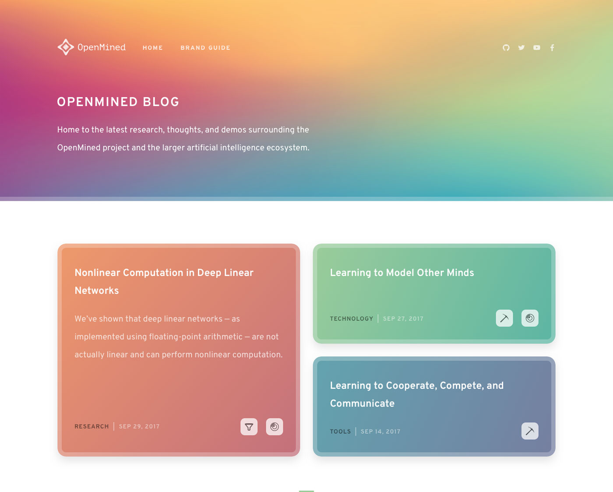

# OpenMined

The default theme for all OpenMined [Ghost](http://github.com/tryghost/ghost/) blogs. This is based heavily on the default Ghost theme [Casper](https://github.com/TryGhost/Casper).



# Development

Styles are compiled using SASS. We use autoprefixer, so you don't worry about writing browser prefixes of any kind, it's all done automatically with support for the latest 2 major versions of every browser. You'll need Node and Gulp installed globally. After that, from the theme's root directory:

```bash
$ yarn install
$ yarn dev
```

Now you can edit `/assets/scss/` files, which will be compiled to `/assets/built/` automatically.

The `zip` Gulp task packages the theme files into `dist/<theme-name>.zip`, which you can then upload to the blog of your choice.

```bash
$ yarn zip
```
